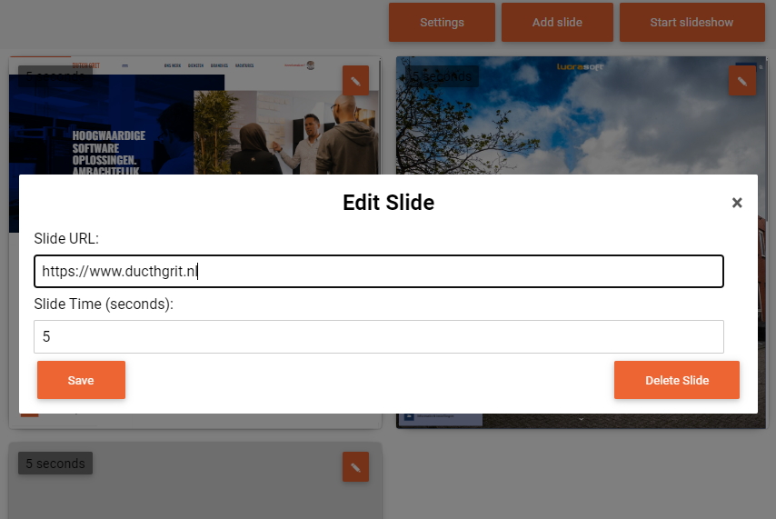

# Slide your Sites

With Slide your Sites you can easily create slideshow presentations for all your online content.

Slide your Site turns every screen in your organization into a showroom with awesome projects, successful solutions and webbased presentations. You can even add traffic-, weather- and market related news to the slides.

# Usage 

Start creating a slide show by adding webpages. Choose “ADD SLIDE” to start.
Choose your URL, set time it needs to be shown and select a transition, use the button below to add the slide to your presentation.
Add as many slides as you wish.
When you are ready hit “START SLIDESHOW” to open a full screen presentation.
Under "SETTINGS" you can
Download your slides to use them later or on a different device.
Import any set of slides you've earlier downloaded.
Delete all slides at once.

# Known issues

Not all websites will work due to iframe restrictions and content policies.

# Development

### Development server

Run `ng serve` for a dev server. Navigate to `http://localhost:4200/`. The application will automatically reload if you change any of the source files.

### Build

Run `ng build` to build the project. The build artifacts will be stored in the `dist/` directory.

